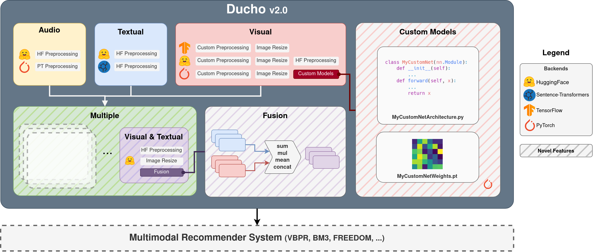

# Ducho v2.0



This is the official GitHub repo for the paper "_Ducho 2.0: Towards a More Up-to-Date Feature Extraction and
Processing Framework for Multimodal Recommendation_".


## Table of contents

- [What is Ducho](#what-is-ducho)
- [Prerequisites](#prerequisites)
  - [Local](#local)
  - [Docker](#docker)
  - [Google Colab](#google-colab)
- [Installation](#installation)
  - [Local and Google Colab](#local-and-google-colab)
  - [Docker](#docker)
- [Try Ducho](#try-ducho)
- [Use Ducho](#use-ducho)
- [The team](#the-team)

## What is Ducho

<table style="border-collapse:collapse;border-spacing:0" class="tg"><thead><tr><th style="border-color:#000000;border-style:solid;border-width:1px;font-family:Arial, sans-serif;font-size:14px;font-weight:normal;overflow:hidden;padding:10px 5px;text-align:center;vertical-align:top;word-break:normal"></th><th style="border-color:#000000;border-style:solid;border-width:1px;font-family:Arial, sans-serif;font-size:14px;font-weight:normal;overflow:hidden;padding:10px 5px;text-align:center;vertical-align:top;word-break:normal" colspan="2"><span style="font-weight:normal">Sources</span></th><th style="border-color:#000000;border-style:solid;border-width:1px;font-family:Arial, sans-serif;font-size:14px;font-weight:normal;overflow:hidden;padding:10px 5px;text-align:center;vertical-align:top;word-break:normal" colspan="4"><span style="font-weight:normal">Backends</span></th></tr></thead><tbody><tr><td style="border-color:#000000;border-style:solid;border-width:1px;font-family:Arial, sans-serif;font-size:14px;overflow:hidden;padding:10px 5px;text-align:center;vertical-align:top;word-break:normal"></td><td style="border-color:#000000;border-style:solid;border-width:1px;font-family:Arial, sans-serif;font-size:14px;overflow:hidden;padding:10px 5px;text-align:center;vertical-align:top;word-break:normal">Items</td><td style="border-color:#000000;border-style:solid;border-width:1px;font-family:Arial, sans-serif;font-size:14px;overflow:hidden;padding:10px 5px;text-align:center;vertical-align:top;word-break:normal">Interactions</td><td style="border-color:#000000;border-style:solid;border-width:1px;font-family:Arial, sans-serif;font-size:14px;overflow:hidden;padding:10px 5px;text-align:center;vertical-align:top;word-break:normal">TensorFlow</td><td style="border-color:#000000;border-style:solid;border-width:1px;font-family:Arial, sans-serif;font-size:14px;overflow:hidden;padding:10px 5px;text-align:center;vertical-align:top;word-break:normal">PyTorch</td><td style="border-color:#000000;border-style:solid;border-width:1px;font-family:Arial, sans-serif;font-size:14px;overflow:hidden;padding:10px 5px;text-align:center;vertical-align:top;word-break:normal">Transformers</td><td style="border-color:#000000;border-style:solid;border-width:1px;font-family:Arial, sans-serif;font-size:14px;overflow:hidden;padding:10px 5px;text-align:left;vertical-align:top;word-break:normal">Sentence-Transformers</td></tr><tr><td style="border-color:#000000;border-style:solid;border-width:1px;font-family:Arial, sans-serif;font-size:14px;overflow:hidden;padding:10px 5px;text-align:center;vertical-align:top;word-break:normal">Audio</td><td style="border-color:#000000;border-style:solid;border-width:1px;font-family:Arial, sans-serif;font-size:14px;overflow:hidden;padding:10px 5px;text-align:center;vertical-align:top;word-break:normal"></td><td style="border-color:#000000;border-style:solid;border-width:1px;font-family:Arial, sans-serif;font-size:14px;overflow:hidden;padding:10px 5px;text-align:center;vertical-align:top;word-break:normal"></td><td style="border-color:#000000;border-style:solid;border-width:1px;font-family:Arial, sans-serif;font-size:14px;overflow:hidden;padding:10px 5px;text-align:center;vertical-align:top;word-break:normal"></td><td style="border-color:#000000;border-style:solid;border-width:1px;font-family:Arial, sans-serif;font-size:14px;overflow:hidden;padding:10px 5px;text-align:center;vertical-align:top;word-break:normal"></td><td style="border-color:#000000;border-style:solid;border-width:1px;font-family:Arial, sans-serif;font-size:14px;overflow:hidden;padding:10px 5px;text-align:center;vertical-align:top;word-break:normal"></td><td style="border-color:#000000;border-style:solid;border-width:1px;font-family:Arial, sans-serif;font-size:14px;overflow:hidden;padding:10px 5px;text-align:left;vertical-align:top;word-break:normal"></td></tr><tr><td style="border-color:#000000;border-style:solid;border-width:1px;font-family:Arial, sans-serif;font-size:14px;overflow:hidden;padding:10px 5px;text-align:center;vertical-align:top;word-break:normal">Visual</td><td style="border-color:#000000;border-style:solid;border-width:1px;font-family:Arial, sans-serif;font-size:14px;overflow:hidden;padding:10px 5px;text-align:center;vertical-align:top;word-break:normal"></td><td style="border-color:#000000;border-style:solid;border-width:1px;font-family:Arial, sans-serif;font-size:14px;overflow:hidden;padding:10px 5px;text-align:center;vertical-align:top;word-break:normal"></td><td style="border-color:#000000;border-style:solid;border-width:1px;font-family:Arial, sans-serif;font-size:14px;overflow:hidden;padding:10px 5px;text-align:center;vertical-align:top;word-break:normal"></td><td style="border-color:#000000;border-style:solid;border-width:1px;font-family:Arial, sans-serif;font-size:14px;overflow:hidden;padding:10px 5px;text-align:center;vertical-align:top;word-break:normal"></td><td style="border-color:#000000;border-style:solid;border-width:1px;font-family:Arial, sans-serif;font-size:14px;overflow:hidden;padding:10px 5px;text-align:center;vertical-align:top;word-break:normal"></td><td style="border-color:#000000;border-style:solid;border-width:1px;font-family:Arial, sans-serif;font-size:14px;overflow:hidden;padding:10px 5px;text-align:left;vertical-align:top;word-break:normal"></td></tr><tr><td style="border-color:#000000;border-style:solid;border-width:1px;font-family:Arial, sans-serif;font-size:14px;overflow:hidden;padding:10px 5px;text-align:center;vertical-align:top;word-break:normal">Textual</td><td style="border-color:#000000;border-style:solid;border-width:1px;font-family:Arial, sans-serif;font-size:14px;overflow:hidden;padding:10px 5px;text-align:center;vertical-align:top;word-break:normal"></td><td style="border-color:#000000;border-style:solid;border-width:1px;font-family:Arial, sans-serif;font-size:14px;overflow:hidden;padding:10px 5px;text-align:center;vertical-align:top;word-break:normal"></td><td style="border-color:#000000;border-style:solid;border-width:1px;font-family:Arial, sans-serif;font-size:14px;overflow:hidden;padding:10px 5px;text-align:center;vertical-align:top;word-break:normal"></td><td style="border-color:#000000;border-style:solid;border-width:1px;font-family:Arial, sans-serif;font-size:14px;overflow:hidden;padding:10px 5px;text-align:center;vertical-align:top;word-break:normal"></td><td style="border-color:#000000;border-style:solid;border-width:1px;font-family:Arial, sans-serif;font-size:14px;overflow:hidden;padding:10px 5px;text-align:center;vertical-align:top;word-break:normal"></td><td style="border-color:#000000;border-style:solid;border-width:1px;font-family:Arial, sans-serif;font-size:14px;overflow:hidden;padding:10px 5px;text-align:center;vertical-align:top;word-break:normal"></td></tr><tr><td style="border-color:#000000;border-style:solid;border-width:1px;font-family:Arial, sans-serif;font-size:14px;overflow:hidden;padding:10px 5px;text-align:left;vertical-align:top;word-break:normal">Visual-Textual</td><td style="border-color:#000000;border-style:solid;border-width:1px;font-family:Arial, sans-serif;font-size:14px;overflow:hidden;padding:10px 5px;text-align:center;vertical-align:top;word-break:normal"></td><td style="border-color:#000000;border-style:solid;border-width:1px;font-family:Arial, sans-serif;font-size:14px;overflow:hidden;padding:10px 5px;text-align:center;vertical-align:top;word-break:normal"></td><td style="border-color:#000000;border-style:solid;border-width:1px;font-family:Arial, sans-serif;font-size:14px;overflow:hidden;padding:10px 5px;text-align:left;vertical-align:top;word-break:normal"></td><td style="border-color:#000000;border-style:solid;border-width:1px;font-family:Arial, sans-serif;font-size:14px;overflow:hidden;padding:10px 5px;text-align:left;vertical-align:top;word-break:normal"></td><td style="border-color:#000000;border-style:solid;border-width:1px;font-family:Arial, sans-serif;font-size:14px;overflow:hidden;padding:10px 5px;text-align:center;vertical-align:top;word-break:normal"></td><td style="border-color:#000000;border-style:solid;border-width:1px;font-family:Arial, sans-serif;font-size:14px;overflow:hidden;padding:10px 5px;text-align:left;vertical-align:top;word-break:normal"></td></tr></tbody></table>
Ducho v2.0 is a Python framework for the extraction of multimodal features for recommendation. It provides a unified interface to most of the common libraries for deep learning (e.g., TensorFlow, PyTorch, Transformers, Sentence-Transformers) to extract high-level features from items (e.g., product images/descriptions) and user-item interactions (e.g., users reviews). It is highly configurable through a YAML-based configuration file (which may be override by input arguments from the command line in case). Users can indicate the source from which to extract the multimodal features (i.e., items/interactions), the modalities (i.e., visual/textual/audio/multiple), and the list of models along with output layers and preprocessing steps to extract the features. Moreover, with the new version of Ducho, users can conduct extractions by utilizing their own pretrained models.

You may choose among three options to run Ducho:

- Locally by cloning this GitHub repo.
- By pulling our docker image on Docker Hub ([link](https://hub.docker.com/repository/docker/sisinflabpoliba/ducho/general)).
- On Google Colab ([link](https://colab.research.google.com/drive/1vPUALePlrjv4rfSn6CX2zMkpH2Xrw_cp)).

## Prerequisites

### Local

Ducho may work on both CPU and GPU, harnessing the power of CUDA and MPS engines. However, if you want to speed up your feature extraction, we highly recommend to go for the GPU-accelerated option. 

In that case, if your machine is equipped with NVIDIA drivers, you should first make sure CUDA is installed along with the compatible NVIDIA drivers. 

For example, a possible working environment involves the following (you may refer to any Google Colab notebook):

```
Nvidia drivers: 525.85.12
Cuda: 11.8.89
Python: 3.11.2
Pip: 23.3.2
```

Please, refer to this [link](https://docs.nvidia.com/cuda/cuda-installation-guide-linux/index.html) for the official guidelines on how to install the nvidia toolkit on linux from scratch.

### Docker

Docker is easily the best option to run any NVIDIA/CUDA-based framework, because it provides docker images with everything already setup for almost all your needs.

First of all, you need to install the docker engine on your machine. Here is the official [link](https://docs.docker.com/engine/install/ubuntu/) for ubuntu. Then, for the sake of the demos provided in this repository, you might also need docker compose (here is a reference [link](https://docs.docker.com/compose/install/standalone/)).

Quite conveniently, you can find several CUDA-equipped images on Docker Hub. You may refer to this [link](https://hub.docker.com/r/nvidia/cuda ). Depending on your CUDA version, you may also need to install nvidia-docker2 (in case, here is a [reference](https://docs.nvidia.com/datacenter/cloud-native/container-toolkit/install-guide.html)).

To test if everything worked smoothly, pull and run a container from the following docker image through this command:

```sh
docker run --rm --gpus all nvidia/cuda:11.8.0-cudnn8-devel-ubuntu22.04 nvidia-smi
```

Once the docker image has been downloaded from the hub, you should be able to see something like this:

```
==========
== CUDA ==
==========

CUDA Version 11.8.0

Container image Copyright (c) 2016-2022, NVIDIA CORPORATION & AFFILIATES. All rights reserved.

This container image and its contents are governed by the NVIDIA Deep Learning Container License.
By pulling and using the container, you accept the terms and conditions of this license:
https://developer.nvidia.com/ngc/nvidia-deep-learning-container-license

A copy of this license is made available in this container at /NGC-DL-CONTAINER-LICENSE for your convenience.

Mon Feb  5 08:11:59 2024       
+-----------------------------------------------------------------------------+
| NVIDIA-SMI 470.129.06   Driver Version: 470.129.06   CUDA Version: 11.8     |
|-------------------------------+----------------------+----------------------+
| GPU  Name        Persistence-M| Bus-Id        Disp.A | Volatile Uncorr. ECC |
| Fan  Temp  Perf  Pwr:Usage/Cap|         Memory-Usage | GPU-Util  Compute M. |
|                               |                      |               MIG M. |
|===============================+======================+======================|
|   0  Tesla T4            Off  | 00000001:00:00.0 Off |                    0 |
| N/A   33C    P0    24W /  70W |      0MiB / 15109MiB |      4%      Default |
|                               |                      |                  N/A |
+-------------------------------+----------------------+----------------------+
                                                                               
+-----------------------------------------------------------------------------+
| Processes:                                                                  |
|  GPU   GI   CI        PID   Type   Process name                  GPU Memory |
|        ID   ID                                                   Usage      |
|=============================================================================|
|  No running processes found                                                 |
+-----------------------------------------------------------------------------+
```
meaning that the installation is ok and you are finally ready to pull Ducho's image (which is actually built from this CUDA image)!

### Google Colab

You just need a Google Drive account!

## Installation

Depending on where you are running Ducho, you might need to first clone this repo and install the necessary packages.

### Local and Google Colab

If you are running Ducho on your local machine or Google Colab, you first need to clone this repository:

```sh
git clone https://github.com/sisinflab/Ducho.git
```

Then, install the needed dependencies through pip:

```sh
pip install -r requirements.txt # Local
pip install -r requirements_colab.txt # Google Colab
```

P.S. Since Google Colab already comes with almost all necessary packages, you just need to install very few missing ones.

Now you are all set to run Ducho (see later).

### Docker

Note that these two steps are not necessary for the docker version because the image already comes with the suitable environment. In this case, you just need to pull our docker image from Docker Hub ([link](https://hub.docker.com/repository/docker/sisinflabpoliba/ducho/general)):

```sh
docker pull sisinflabpoliba/ducho
```

After the installation, you will be prompted to a command line, where you can run Ducho (see later).

## Try Ducho

To ease the usage of Ducho, here we provide a demo spanning different multimodal recommendation scenarios. Use it to better familiarize with the framework:

- **Demo RecSys:**  It performs visual, textual and multiple feature extraction from items. More precisely, it demonstrates the process of extracting visual and textual features, incorporating custom models as well. Additionally, it showcases the extraction of visual-textual features via multiple modality ([link](demos/demo_recsys/README.md)).

To perform the recommendation task utilizing the features extracted by Ducho v2.0, please refer to the following GitHub repository ([link](https://github.com/sisinflab/Formal-MultiMod-Rec)).

## Use Ducho

Once you have familiarized with Ducho, you can use it for your own datasets and custom multimodal feature extractions! Please refer to the official [documentation](https://ducho.readthedocs.io/en/latest/) where all modules, classes, and methods are explained in detail.

You may also consider to take a look at this [guideline](config/README.md) to better understand how to fill in your custom configuration files.

Independently on where you are using Ducho, here are the basic instructions to run a custom multimodal extraction pipeline.

Assuming all input data has been placed in the correct folder, and the configuration file has been filled in, you can use our convenient ```run.sh``` script:

```sh
python3 run.py --config=<path_to_config_file> [--additional_argument_1=additional_value_1, --additional_argument_2=additional_value_2, ...]
```

where the path to your custom configuration file is needed to override the existing default one (which does no specific actions), while the additional argument/value pairs are optional to override some of the condiguration parameters from the command line. 

As the configuration dictionary derived from the configuration file is built on nested dictionaries, the argument may come in the form of ```key1.key2.key3...keyn```. For example, if you want to override the input path of the textual interaction data, you should write:

```sh
python3 run.py --config=<path_to_config_file> --textual.interactions.input_path=<path_to_input>
```
this will override the same entry in the configuration file you provided. We do recommend to use this command line overriding just for simple configuration parameters (as in the reported example) since the framework is currently not tested to override, for example, model paramters (which are stored in complex list of dictionary structures).

## The team
Currently, Ducho is maintained by:
- Matteo Attimonelli (matteo.attimonelli@poliba.it)
- Danilo Danese (danilo.danese@poliba.it)
- Daniele Malitesta (daniele.malitesta@poliba.it)
- Giuseppe Gassi (g.gassi@studenti.poliba.it)
- Claudio Pomo (claudio.pomo@poliba.it)
- Tommaso Di Noia (tommaso.dinoia@poliba.it)
