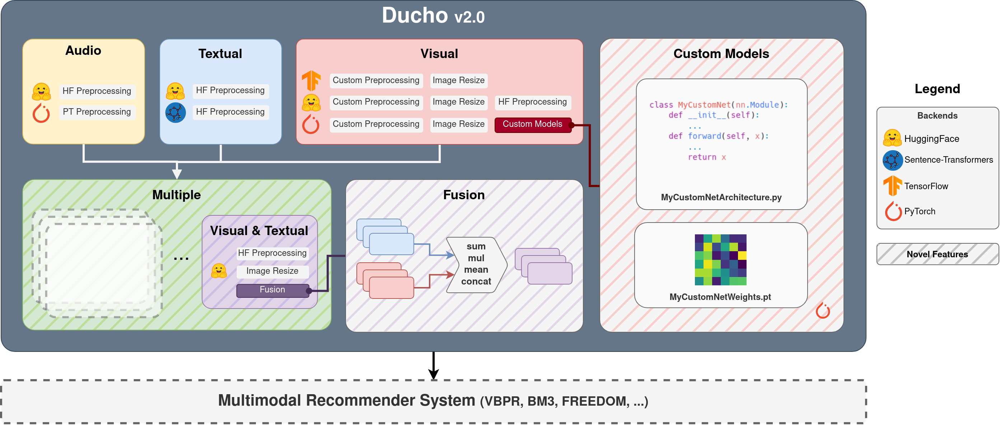

.. Ducho documentation master file, created by
   sphinx-quickstart on Tue May 30 17:32:12 2023.
   You can adapt this file completely to your liking, but it should at least
   contain the root `toctree` directive.

Welcome to Ducho's documentation!
=================================

What is Ducho
-------------

Ducho v2.0 is a Python framework for the extraction of multimodal features for recommendation. It provides a unified interface to most of the common libraries for deep learning (e.g., TensorFlow, PyTorch, Transformers, Sentence-Transformers) to extract high-level features from items (e.g., product images/descriptions) and user-item interactions (e.g., users reviews). It is highly configurable through a YAML-based configuration file (which may be override by input arguments from the command line in case). Users can indicate the source from which to extract the multimodal features (i.e., items/interactions), the modalities (i.e., visual/textual/audio/multiple), and the list of models along with output layers and preprocessing steps to extract the features. Moreover, with the new version of Ducho, users can conduct extractions by utilizing their own pretrained models.

   system schema

.. flat-table:: Backends-Modalities available settings in Ducho v2.0
   :header-rows: 2

   * -
     - :cspan:`1` Sources
     - :cspan:`2` Backends
   * -
     - Items
     - Interactions
     - TensorFlow
     - PyTorch
     - Transformers
     - Sentence-Transformers
   * - Audio
     - .. image:: ./img/checkbox-mark.png
          :align: center
     - .. image:: ./img/checkbox-mark.png
          :align: center
     -
     - .. image:: ./img/checkbox-mark.png
          :align: center
     - .. image:: ./img/checkbox-mark.png
          :align: center
     -
   * - Visual
     - .. image:: ./img/checkbox-mark.png
          :align: center
     - .. image:: ./img/checkbox-mark.png
          :align: center
     - .. image:: ./img/checkbox-mark.png
          :align: center
     - .. image:: ./img/checkbox-mark.png
          :align: center
     - .. image:: ./img/checkbox-mark.png
          :align: center
     -
   * - Text
     - .. image:: ./img/checkbox-mark.png
          :align: center
     - .. image:: ./img/checkbox-mark.png
          :align: center
     -
     -
     - .. image:: ./img/checkbox-mark.png
          :align: center
     - .. image:: ./img/checkbox-mark.png
          :align: center
   * - Visual-Textual
     - .. image:: ./img/checkbox-mark.png
          :align: center
     - .. image:: ./img/checkbox-mark.png
          :align: center
     -
     -
     - .. image:: ./img/checkbox-mark.png
          :align: center
     -

.. toctree::
   :maxdepth: 1
   :caption: GET STARTED

   guide/introduction
   guide/install
   guide/quick_start

.. toctree::
   :maxdepth: 1
   :caption: API REFERENCE:

   ducho/ducho
   ducho/ducho.config
   ducho/ducho.internal
   ducho/ducho.multimodal
   ducho/ducho.runner

Indices and tables
==================

* :ref:`genindex`
* :ref:`modindex`
* :ref:`search`
